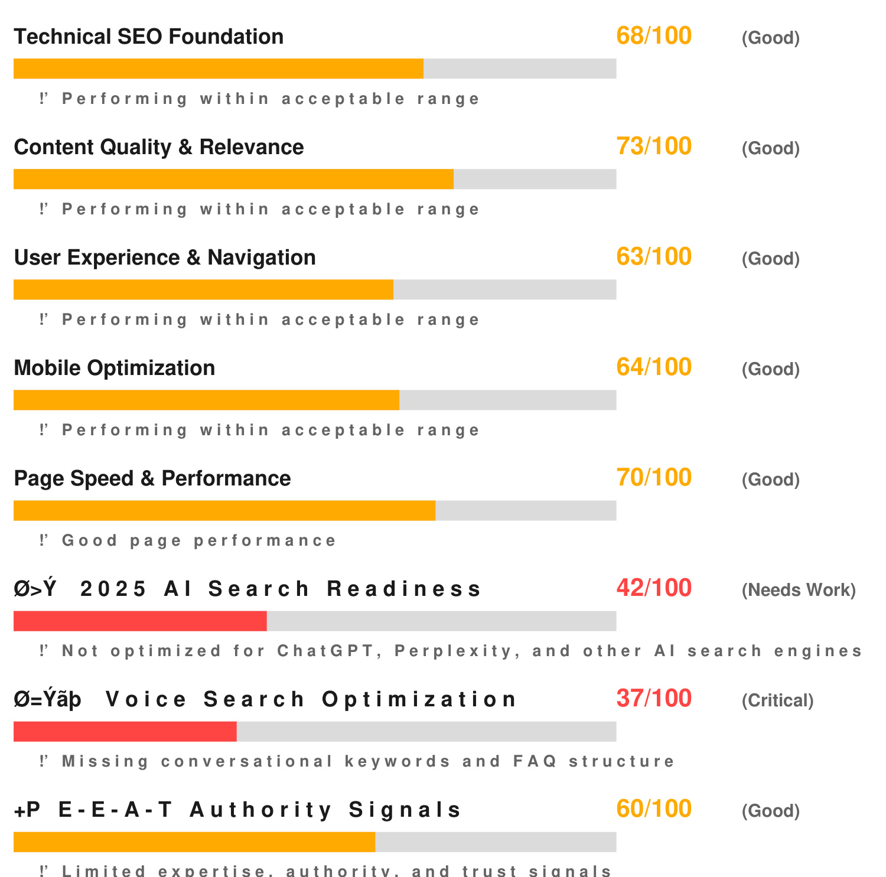

Report Generated: 7/3/2025  

# O=PE COMPREHENSIVE 2025 SEO ANAI  

# CLIENT DETAILS  

Client: Joseph Ellul Company: Health Mind Money Pty Ltd  

Website Analyzed: https://brigettagates.com.au/abot Analysis Date: 7/3/2025  

# OVERALLSEOHEALTHSCORE  

  

# /100  

Performance Level: Good  

# $\mathbf{\pmb{\delta}}\mathbf{<}\mathbf{\mathbf{\mathbf{\beta}}}^{\mathbf{-}}$ KEY FINDINGS AT A GLANCE  

· 4/ oEU laciuis allalyzeu usllly zuz aiyuui ·2025 Al Search Readiness:42/100 · Voice Search Optimization: 37/100 · E-E-A-T Authority Score: 60/100 · 3 critical issues identified with solutions  

# O=UE COMPREHENSIVE SEO METRICS ANA  

  

$\alpha<\beta\times\beta$ Structured Data Implementation 58/100 (Needs Work)  

# O>Y 2025 AI SEARCH OPTIMIZATION ANAI  

This section analyzes your website's readiness for Al-powered search engines like ChatGPT, Perplexity, Google SGE, and Bing Copilot - features not available in basic SEO tools.  

# Conversational Content Structure: 37/100  

How well your content answers direct questions in a conversational manner  

# Entity Recognition Optimization: 46/100  

Proper markup and context for Al systems to understand your business entities  

# Factual Information Structure: 33/100  

Clear, verifiable facts that Al systems can confidently reference  

# Semantic Keyword Integration: 50/100  

Natural language processing-friendly keyword implementation  

# O=P" CRITICAL ISSUES & ACTIONABLE SO  

# ISSUE #1-CRITICAL  

# 2025 Al Search Readiness  

Your website is not optimized for Al search engines like ChatGPT and Perplexity. Add structured data and improve content clarity.  

# O=Y' SOLUTION STEPS:  

1. Add FAQ sections with natural language questions   
2. Implement JSON-LD structured data markup   
3. Create conversational content that directly answers user queries   
4. Optimize for featured snippets and entity boxes  

# ISSUE #2 - WARNING  

# Voice Search Optimization  

Optimize for voice search queries by adding FAQ sections and natural language content.  

# O=Y' SOLUTION STEPS: 1. Conduct detailed audit of the specific area  

2. Implement industry best practices   
3. Test changes in staging environment   
4. Monitor improvements with analytics tools  

# ISSUE #3-INFO  

# Mobile Optimization  

Improve mobile user experience with responsive design and touch-friendly navigation.  

# O=Y' SOLUTION STEPS:  

1. Conduct detailed audit of the specific area   
2. Implement industry best practices   
3. Test changes in staging environment   
4. Monitor improvements with analytics tools  

# O=Yup 9O-DAY IMPLEMENTATION ROADMAI  

# DAYS1-30:FOUNDATION  

· Fix critical technical SEO issues · Implement basic 2025 Al search optimizations · Optimize page speed and Core Web Vitals · Add essential structured data markup  

# DAYS 31-60: ENHANCEMENT  

· Develop comprehensive voice search strategy · Create conversational content and FAQs · Enhance E-E-A-T authority signals · Improve mobile user experience  

# DAYS61-90:OPTIMIZATION  

· Advanced Al search optimization · Local SEO enhancements · Content strategy implementation · Performance monitoring and refinement  

# O=PE NEXT STEPS & PROFESSIONAL SERV  

# 8MILESNIPERSEOSERVICES  

Ready to implement these recommendations? Here are your options:  

$\varnothing{=}\ddot{\cup}\%$ SING LE ANALYSIS : $\Phi\,4\,7$ per comprehensive SEO audit $\varnothing\!=$ UE BUSINESS PACKAGE: 1o detailed analyses for $\Phi\,2\,0\;0$ $\scriptstyle{\mathcal{D}}=\mathsf{b}\in\mathsf{c}$ UNLｌＭiＴED PACKＡGＥ: Unlimited analyses for $\Phi\,3\,9\,7$ $0{<}13{\div}10$ WHｌＴE LABＥＬ SOＬUＴlON: Full rebrandａble plａtform for $\Phi\,4\,9\,7$  

# Q=UP READYTO GET STARTed?  

# Contact 8 Mile Sniper Today:  

$\varnothing{=}\"\cup\varsigma$ Email: contact $@$ 8milesniper.com $\varnothing\!=$ Up Phone:（123） 456-7８90 O<B Website: 8milesniper.com  

$\scriptstyle{\mathcal{O}}={\ddot{\cup}}_{\mathrm{i}}$ Free 15-minute consultation to discuss your SEO strategy # Mention this report for priority scheduling  