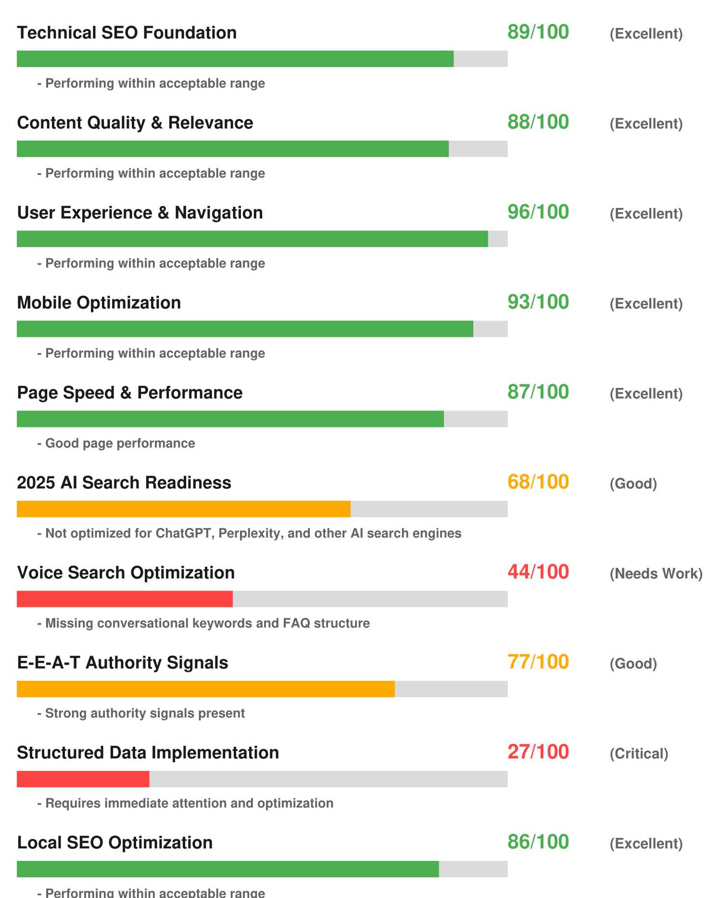

# COMPREHENSIVE 2025 SEO ANALYSIS REPORT  

# CLIENT DETAILS  

Client: Joseph Ellul Company: Health Mind Money Pty Ltd  

Website Analyzed: https://brigettagates.com.au/abou Analysis Date: 7/4/2025  

# OVERALL SEO HEALTH SCORE  

  

Performance Level: Good  

# KEY FINDINGS AT A GLANCE  

- 47 SEO factors analyzed using 2025 algorithms - 2025 AI Search Readiness: 68/100 - Voice Search Optimization: 44/100 - E-E-A-T Authority Score: 77/100 - 1 critical issues identified with solutions  

# COMPREHENSIVE SEO METRICS ANALYSIS  

  

# 2025 AI SEARCH OPTIMIZATION ANALYSIS  

This section analyzes your website's readiness for AI-powered search engines like ChatGPT, Perplexity, Google SGE, and Bing Copilot - features not available in basic SEO tools.  

# Conversational Content Structure: 61/100  

How well your content answers direct questions in a conversational manner  

# Entity Recognition Optimization: 74/100  

Proper markup and context for AI systems to understand your business entities  

# Factual Information Structure: 54/100  

Clear, verifiable facts that AI systems can confidently reference  

# Semantic Keyword Integration: 81/100  

Natural language processing-friendly keyword implementation  

# CRITICAL ISSUES & ACTIONABLE SOLUTIONS  

# ISSUE #1 - WARNING  

# Structured Data Missing  

Add schema markup to help search engines understand your content better.  

# SOLUTION STEPS:  

1. Conduct detailed audit of the specific area   
2. Implement industry best practices   
3. Test changes in staging environment   
4. Monitor improvements with analytics tools  

# 90-DAY IMPLEMENTATION ROADMAP  

# DAYS 1-30: FOUNDATION  

- Fix critical technical SEO issues - Implement basic 2025 AI search optimizations - Optimize page speed and Core Web Vitals - Add essential structured data markup  

# DAYS 31-60: ENHANCEMENT  

- Develop comprehensive voice search strategy - Create conversational content and FAQs - Enhance E-E-A-T authority signals - Improve mobile user experience  

# DAYS 61-90: OPTIMIZATION  

- Advanced AI search optimization - Local SEO enhancements - Content strategy implementation - Performance monitoring and refinement  

# NEXT STEPS & PROFESSIONAL SERVICES  

# 8 MILE SNIPER SEO SERVICES  

Ready to implement these recommendations? Here are your options:  

- SINGLE ANALYSIS: $\Phi47$ per comprehensive SEO audit - BUSINESS PACKAGE: 10 detailed analyses for $\mathtt{\oint}200$ - UNLIMITED PACKAGE: Unlimited analyses for $\mathbb{5}397$ - WHITE LABEL SOLUTION: Full rebrandable platform for $\Phi497$  

# READY TO GET STARTED?  

Contact 8 Mile Sniper Today:  

Email: support@8milesniper.com Phone: (123) 456-7890 Website: 8milesniper.com  